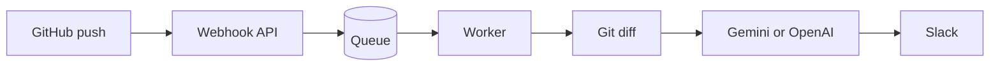

# GitHub Change Bot

GitHub Change Bot watches code pushes and posts a clear summary to Slack. It
uses the real Git diff, relevant nearby code, and Gemini or OpenAI to explain
what changed and why it matters.



The webhook responds immediately. The worker handles Git, AI, and Slack in
the background, so GitHub never waits for a long analysis.

## Slack notification

Each notification presents a risk-led header, branch, author, change size,
summary, key changes, affected areas, compact commit details, and a direct
GitHub diff link in one Slack card.

## Project files

Keep the files you manage in the project root:

```text
github-change-bot/
├── .env                 your private configuration; never commit it
├── id_ed25519           existing GitHub-readable SSH private key; never commit it
├── id_ed25519.pub       public half of the SSH key
├── README.md            this guide
├── scripts/install_systemd.sh
├── compose.yaml
└── app/
```

`.env`, `id_ed25519`, and `id_ed25519.pub` are ignored by Git. During systemd
installation, the installer copies them into protected service locations. The
original root-project files remain unchanged.

## Before you start

You need:

- A Linux VM with Python 3.12, Git, rsync, curl, and systemd.
- A GitHub account and a repository you want the bot to watch.
- An SSH key with read access to that repository.
- A Google Gemini API key or OpenAI API key.
- A Slack workspace and a channel for bot summaries.

## 1. Clone the project

On a new Ubuntu or Debian VM, install the required packages first:

```bash
sudo apt update
sudo apt install -y python3.12 python3.12-venv git rsync curl
```

Then clone the project:

```bash
git clone git@github.com:jvishwa-sqy/github-change-bot.git
cd github-change-bot
```

## 2. Put your SSH key in the project root

Copy the existing key that can clone your GitHub repositories:

```bash
cp /path/to/your/existing/id_ed25519 ./id_ed25519
cp /path/to/your/existing/id_ed25519.pub ./id_ed25519.pub
chmod 600 ./id_ed25519
chmod 644 ./id_ed25519.pub
```

Check that the key can access GitHub:

```bash
ssh -i ./id_ed25519 -o IdentitiesOnly=yes -T git@github.com
```

Expected output includes your GitHub username. If you see `Permission denied`,
add `id_ed25519.pub` to GitHub first:

- For one repository: **Repository → Settings → Deploy keys → Add deploy key**.
  Leave write access disabled.
- For several repositories: add the key to a GitHub user that has read access
  to all of them.

## 3. Create `.env` in the project root

```bash
cp .env.example .env
chmod 600 .env
```

Open `.env` and set the required values below.

```env
# GitHub verifies every webhook with this value.
GITHUB_WEBHOOK_SECRET=replace-with-a-random-secret

# Where summaries are sent.
SLACK_WEBHOOK_URL=https://hooks.slack.com/services/...

# Choose one AI provider.
LLM_PROVIDER=google
GOOGLE_API_KEY=replace-with-your-google-api-key
GOOGLE_MODEL=gemini-2.5-flash
GOOGLE_THINKING_BUDGET=0
```

Generate a secure GitHub webhook secret:

```bash
openssl rand -hex 32
```

If you use OpenAI instead of Google, use this part of `.env`:

```env
LLM_PROVIDER=openai
OPENAI_API_KEY=replace-with-your-openai-api-key
OPENAI_MODEL=gpt-5
```

Do not set both providers unless you intend to keep one unused. The value of
`LLM_PROVIDER` decides which API key the bot uses.

## 4. Create the Slack webhook

Suggested Slack app description: **Turns GitHub code pushes into clear,
AI-powered Slack change summaries.**

1. Go to <https://api.slack.com/apps> and select **Create New App**.
2. Choose **From scratch**, give it a name such as `GitHub Change Bot`, and
   select your Slack workspace.
3. Open **Incoming Webhooks** in the left menu.
4. Turn on **Activate Incoming Webhooks**.
5. Click **Add New Webhook to Workspace**.
6. Select the Slack channel that should receive code-change summaries.
7. Click **Allow**.
8. Copy the generated webhook URL. It starts with
   `https://hooks.slack.com/services/`.
9. Paste it into `.env` as `SLACK_WEBHOOK_URL`.

Treat the Slack webhook URL like a password. Anyone with it can post messages
to that Slack channel. If it is exposed, delete the webhook in Slack and
create a new one.

## 5. Get an AI API key

### Google Gemini

1. Go to <https://aistudio.google.com/apikey>.
2. Create an API key.
3. Copy it into `.env` as `GOOGLE_API_KEY`.
4. Keep `LLM_PROVIDER=google`.

### OpenAI

1. Go to <https://platform.openai.com/api-keys>.
2. Create a secret API key.
3. Copy it into `.env` as `OPENAI_API_KEY`.
4. Set `LLM_PROVIDER=openai`.

Treat AI API keys as passwords. Rotate a key immediately if it is shared in a
chat, committed, or otherwise exposed.

## 6. Install and start the bot

From the project root, run:

```bash
sudo ./scripts/install_systemd.sh
```

The installer uses `./.env` and `./id_ed25519` by default. It creates:

```text
/opt/git-change-bot                 deployed application code
/etc/git-change-bot.env             protected runtime configuration
/var/lib/git-change-bot             queue, Git mirrors, indexes, service key
```

It also starts two services:

```text
git-change-bot-web       receives GitHub webhooks
git-change-bot-worker    analyses pushes and sends Slack summaries
```

Check the installation:

```bash
curl -sS http://127.0.0.1:8088/health
sudo systemctl status git-change-bot-web git-change-bot-worker --no-pager
```

Expected health response:

```json
{"status":"ok"}
```

## 7. Get a free public HTTPS URL for testing

GitHub must reach the bot over public HTTPS. If you do not have a domain, use
a free Cloudflare Quick Tunnel. Its URL changes after the tunnel restarts, so
use it for testing only.

Install `cloudflared` on Ubuntu or Debian:

```bash
curl --fail --location --output /tmp/cloudflared.deb \
  https://github.com/cloudflare/cloudflared/releases/latest/download/cloudflared-linux-amd64.deb
sudo dpkg -i /tmp/cloudflared.deb
```

Start the tunnel:

```bash
cloudflared tunnel --url http://127.0.0.1:8088
```

It prints a URL similar to:

```text
https://example-name.trycloudflare.com
```

Keep the command running. Your webhook URL is:

```text
https://example-name.trycloudflare.com/webhooks/github
```

## 8. Add the GitHub webhook

Open the repository you want the bot to monitor:

```text
Repository → Settings → Webhooks → Add webhook
```

Fill the form like this:

| GitHub field | Value |
|---|---|
| Payload URL | Your public URL ending in `/webhooks/github` |
| Content type | `application/json` |
| Secret | The `GITHUB_WEBHOOK_SECRET` from `.env` |
| SSL verification | Enable SSL verification |
| Events | Just the push event |
| Active | Checked |

GitHub sends a ping after you save. A successful delivery has HTTP status 200
and response body:

```json
{"status":"pong"}
```

Repeat this step for every repository the bot should monitor.

## 9. Bootstrap the repository

Run this once for each repository you monitor. Replace the placeholders:

```bash
sudo -u gitbot env BOT_ENV_FILE=/etc/git-change-bot.env \
  /opt/git-change-bot/.venv/bin/python /opt/git-change-bot/scripts/bootstrap_repo.py \
  --project-id GITHUB_REPOSITORY_ID \
  --repo-url git@github.com:OWNER/REPOSITORY.git \
  --project-name OWNER/REPOSITORY \
  --ref main
```

Find the numeric ID at:

```text
https://api.github.com/repos/OWNER/REPOSITORY
```

Bootstrap only creates the Git mirror and repository map. It does not call AI
or send Slack messages.

Repeat this step for every monitored repository before its first push.

## 10. Test it

Make a small real change in the monitored repository and push it:

```bash
git add .
git commit -m "Test GitHub Change Bot"
git push origin main
```

Watch the worker:

```bash
sudo journalctl -u git-change-bot-worker -f
```

Expected result:

```text
push enqueued → job started → diff computed → AI response → Slack notified → job completed
```

## Docker option

If you prefer Docker instead of systemd:

```bash
export BOT_SSH_DIR="$PWD"
docker compose up --build -d
curl -sS http://127.0.0.1:8088/health
```

Docker reads `.env` and copies the root-project `id_ed25519` key into the
container only while it is running. The key is not stored in the image or
Docker volume. The same command starts the `web`, `worker`, and free `tunnel`
services.

Get the temporary public URL with:

```bash
docker compose logs tunnel
```

The logs contain a temporary `trycloudflare.com` URL. Add
`/webhooks/github` to that URL when configuring GitHub. The URL changes if
the tunnel container restarts.

## Move to another VM

1. Clone this repository on the new VM.
2. Securely copy `.env`, `id_ed25519`, and `id_ed25519.pub` into the new
   project root.
3. Run `sudo ./scripts/install_systemd.sh`.
4. Bootstrap each monitored repository on the new VM.
5. Update the GitHub webhooks with the new public URL.
6. Stop the services on the old VM only after the new VM works.

## Useful commands

```bash
# Health and queue counts
curl -sS http://127.0.0.1:8088/ready

# Service state
sudo systemctl is-active git-change-bot-web git-change-bot-worker

# Recent worker logs
sudo journalctl -u git-change-bot-worker -n 100 --no-pager

# Restart after changing runtime configuration
sudo systemctl restart git-change-bot-web git-change-bot-worker
```
