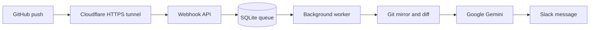

# GitHub Change Bot

GitHub Change Bot watches repository pushes and posts clear, AI-generated
change summaries to Slack. It uses the real Git diff, selected nearby source
code, and Google Gemini to report the risk level, change size, key changes,
affected areas, and a link to the GitHub diff.

Docker Compose is the only supported deployment method. One command starts
the webhook API, background worker, persistent storage, and a free Cloudflare
HTTPS tunnel.

## How it works



The API verifies the GitHub signature, saves the push to SQLite, and responds
immediately. The worker processes that queued push separately, so GitHub does
not wait for Git, Gemini, or Slack.

## Before you begin

You need:

- A Linux VM with internet access.
- A user account that can run `sudo`.
- A GitHub repository to monitor.
- An existing SSH key with read access to that repository.
- A free Google Gemini API key.
- Permission to create a Slack app in your workspace.

You do not need a domain name. The included Cloudflare Quick Tunnel provides
a free public HTTPS URL. The URL changes when the tunnel container is
recreated, so this setup is best suited to a small internal tool.

## 1. Install Docker and Git

First check whether they are already installed:

```bash
git --version
docker --version
docker compose version
```

If all three commands print a version, continue to step 2.

For Ubuntu or Debian, install Git and the basic tools:

```bash
sudo apt update
sudo apt install -y git curl ca-certificates openssh-client
```

Then install Docker Engine and the Compose plugin using the
[official Docker installation guide](https://docs.docker.com/engine/install/).
After installation, confirm both commands work:

```bash
sudo docker run --rm hello-world
sudo docker compose version
```

To run Docker without `sudo`, add your current user to the Docker group:

```bash
sudo usermod -aG docker "$USER"
```

Log out of the VM and log in again. Then verify:

```bash
docker ps
```

## 2. Clone this project

Run:

```bash
git clone git@github.com:jvishwa-sqy/github-change-bot.git
cd github-change-bot
```

Run every remaining command from this project directory. Confirm your current
location with:

```bash
pwd
ls -la
```

You should see `compose.yaml`, `config.py`, `start.sh`, and `.env.example`.

## 3. Add the GitHub SSH key

The bot uses an SSH key to create read-only Git mirrors. It never needs write
access to a monitored repository.

If your existing key is `~/.ssh/id_ed25519`, copy it into the project root:

```bash
cp ~/.ssh/id_ed25519 ./id_ed25519
cp ~/.ssh/id_ed25519.pub ./id_ed25519.pub
chmod 600 ./id_ed25519
chmod 644 ./id_ed25519.pub
```

If your key has a different name, replace the source paths in those commands.
Do not rename unrelated private keys or generate a new key unless you need one.

If the private key exists but its `.pub` file does not, create the public file
from the existing private key:

```bash
ssh-keygen -y -f ./id_ed25519 > ./id_ed25519.pub
chmod 644 ./id_ed25519.pub
```

Test the copied key:

```bash
ssh -i ./id_ed25519 -o IdentitiesOnly=yes -T git@github.com
```

GitHub should say that you authenticated successfully. GitHub does not provide
shell access, so the command may still return exit code 1; the authentication
message is what matters.

If authentication fails, add `id_ed25519.pub` to GitHub:

1. Open the monitored repository on GitHub.
2. Select **Settings**.
3. Select **Deploy keys**.
4. Select **Add deploy key**.
5. Enter a title such as `GitHub Change Bot`.
6. Paste the contents of `id_ed25519.pub`.
7. Leave **Allow write access** unchecked.
8. Select **Add key**.
9. Run the SSH test command again.

GitHub deploy keys are attached to a single repository. To monitor several
repositories with this one-key setup, use an SSH key belonging to a dedicated
GitHub account that has read access to every monitored repository.

## 4. Create a Gemini API key

1. Open [Google AI Studio](https://aistudio.google.com/apikey).
2. Sign in with your Google account.
3. Select **Create API key**.
4. Choose or create a Google Cloud project if requested.
5. Copy the generated key and keep it private.

The default model is `gemini-2.5-flash`. You can change it later in
`config.py`.

## 5. Create the Slack webhook

1. Open [Slack Apps](https://api.slack.com/apps).
2. Select **Create New App**.
3. Select **From scratch**.
4. Enter `GitHub Change Bot` as the app name.
5. Select your Slack workspace and create the app.
6. Open **Incoming Webhooks** from the left menu.
7. Turn on **Activate Incoming Webhooks**.
8. Select **Add New Webhook to Workspace**.
9. Choose the channel that should receive summaries.
10. Select **Allow**.
11. Copy the generated URL. It begins with
    `https://hooks.slack.com/services/`.

Suggested Slack app description:

```text
Turns GitHub code pushes into clear, AI-powered Slack change summaries.
```

The webhook URL is a secret. Anyone who has it can post to the selected Slack
channel. If it is exposed, delete it in Slack and create a replacement.

## 6. Create and fill `.env`

Create the private environment file:

```bash
cp .env.example .env
chmod 600 .env
```

Generate a GitHub webhook secret:

```bash
openssl rand -hex 32
```

Copy the generated value. Open `.env` with your preferred editor:

```bash
nano .env
```

Fill all three values:

```env
GITHUB_WEBHOOK_SECRET=paste-the-openssl-value-here
GOOGLE_API_KEY=paste-the-google-ai-studio-key-here
SLACK_WEBHOOK_URL=https://hooks.slack.com/services/paste-your-values-here
```

Save the file. In Nano, press `Ctrl+O`, press `Enter`, and then press `Ctrl+X`.

Confirm that the three variable names exist without printing their secret
values:

```bash
awk -F= '/^(GITHUB_WEBHOOK_SECRET|GOOGLE_API_KEY|SLACK_WEBHOOK_URL)=/ {print $1 " is set"}' .env
```

Expected output:

```text
GITHUB_WEBHOOK_SECRET is set
GOOGLE_API_KEY is set
SLACK_WEBHOOK_URL is set
```

Never commit `.env`. It is already listed in `.gitignore`.

## 7. Review `config.py`

The committed root `config.py` contains non-secret runtime settings. The
default values are ready for a small internal deployment, so a first-time user
normally does not need to change them.

The settings you are most likely to adjust are:

| Setting | Default | Purpose |
|---|---:|---|
| `google_model` | `gemini-2.5-flash` | Gemini model used for summaries |
| `google_thinking_budget` | `0` | Keeps Gemini thinking-token cost low |
| `watched_branches` | `[]` | Empty means watch every branch |
| `extra_ignore_patterns` | `[]` | Adds files or folders that should not be analysed |
| `log_level` | `INFO` | Controls application log detail |

Examples:

```python
# Analyse only main and develop.
"watched_branches": ["main", "develop"],

# Ignore generated files in addition to built-in ignore rules.
"extra_ignore_patterns": ["generated/**", "*.generated.ts"],
```

Keep credentials out of `config.py`. The GitHub secret, Gemini key, and Slack
webhook belong only in `.env`.

## 8. Start the complete service

The startup script validates required files and secrets, fixes safe file
permissions, builds the images, starts all containers, waits for API health,
and prints the Cloudflare URL.

Run:

```bash
./start.sh
```

It starts:

| Container | Purpose |
|---|---|
| `web` | Receives and verifies GitHub webhooks |
| `worker` | Builds diffs, calls Gemini, and posts to Slack |
| `tunnel` | Exposes the local API through public HTTPS |

Check the containers:

```bash
docker compose ps
```

`web` should show `healthy`; `worker` and `tunnel` should show `Up`.

Check the local API:

```bash
curl -sS http://127.0.0.1:8088/health
```

Expected response:

```json
{"status":"ok"}
```

## 9. Get and verify the public tunnel URL

Print only the current Cloudflare URL:

```bash
docker compose logs tunnel \
  | grep -Eo 'https://[-a-z0-9]+\.trycloudflare\.com' \
  | tail -n 1
```

Suppose it prints:

```text
https://example-name.trycloudflare.com
```

Your complete GitHub webhook URL is:

```text
https://example-name.trycloudflare.com/webhooks/github
```

Before configuring GitHub, verify the public health endpoint:

```bash
curl -i https://example-name.trycloudflare.com/health
```

Continue only after it returns HTTP 200 with `{"status":"ok"}`. A new tunnel
can take several seconds to become reachable.

## 10. Add the GitHub webhook

Repeat this step for every repository you want to monitor.

1. Open the repository on GitHub.
2. Select **Settings**.
3. Select **Webhooks**.
4. Select **Add webhook**.
5. Fill the form exactly as follows:

| GitHub field | Value |
|---|---|
| Payload URL | Your current tunnel URL plus `/webhooks/github` |
| Content type | `application/json` |
| Secret | The exact `GITHUB_WEBHOOK_SECRET` value from `.env` |
| SSL verification | **Enable SSL verification** |
| Events | **Just the push event** |
| Active | Checked |

6. Select **Add webhook**.
7. Open the new webhook and inspect **Recent Deliveries**.
8. The ping delivery should return HTTP 200 and `{"status":"pong"}`.

If the tunnel container is recreated, it receives a new URL. Replace the
Payload URL in every GitHub webhook with the new URL.

## 11. Bootstrap the repository

The worker needs a local bare Git mirror and repository map before the first
push. Run this once for every monitored repository.

First find the numeric GitHub repository ID:

1. Replace `OWNER` and `REPOSITORY` in this URL.
2. Open it in a browser:

```text
https://api.github.com/repos/OWNER/REPOSITORY
```

3. Find the top-level `"id"` value near the beginning of the response.

Then run the bootstrap command, replacing all uppercase placeholders:

```bash
docker compose exec --user 10001:10001 worker \
  python scripts/bootstrap_repo.py \
  --project-id GITHUB_REPOSITORY_ID \
  --repo-url git@github.com:OWNER/REPOSITORY.git \
  --project-name OWNER/REPOSITORY \
  --ref main
```

Example:

```bash
docker compose exec --user 10001:10001 worker \
  python scripts/bootstrap_repo.py \
  --project-id 123456789 \
  --repo-url git@github.com:acme/example.git \
  --project-name acme/example \
  --ref main
```

A successful run prints `Mirror created` and the repository-map location. It
does not call Gemini or send a Slack message.

## 12. Test the complete flow

In the monitored repository, make a small real change and push it:

```bash
git add .
git commit -m "Test GitHub Change Bot"
git push origin main
```

On the bot VM, follow the worker logs:

```bash
docker compose logs --follow worker
```

The successful sequence is:

```text
job started
diff computed
llm response
slack notified
job completed
```

Confirm that the summary appears in the configured Slack channel. Press
`Ctrl+C` to stop following logs; the containers continue running.

## Everyday commands

Run these commands from the project root:

```bash
# Show container state.
docker compose ps

# Check API health and queue counts.
curl -sS http://127.0.0.1:8088/ready

# Show recent worker activity.
docker compose logs --tail 100 worker

# Follow new worker activity.
docker compose logs --follow worker

# Print the current tunnel URL.
docker compose logs tunnel \
  | grep -Eo 'https://[-a-z0-9]+\.trycloudflare\.com' \
  | tail -n 1

# Rebuild and start after pulling code or editing configuration.
./start.sh

# Stop all containers while preserving data.
docker compose down
```

The `bot-data` Docker volume stores the SQLite queue, Git mirrors, and
repository maps. `docker compose down` preserves this volume.

Do not run `docker compose down -v` unless you intentionally want to delete
the queue, every mirror, and every repository map. After deleting the volume,
you must bootstrap every repository again.

## Update the bot

From the project root:

```bash
git pull --ff-only
./start.sh
```

Then check:

```bash
docker compose ps
curl -sS http://127.0.0.1:8088/health
```

## Move the bot to another VM

1. Install Docker and Git on the new VM.
2. Clone this repository on the new VM.
3. Securely copy `.env`, `id_ed25519`, and `id_ed25519.pub` into the new
   project root. `config.py` comes from Git.
4. Set the SSH file permissions shown in step 3.
5. Run `./start.sh` on the new VM.
6. Get and verify the new Cloudflare tunnel URL.
7. Update every GitHub webhook Payload URL.
8. Bootstrap every monitored repository on the new VM.
9. Push a small test commit and confirm the Slack message.
10. Run `docker compose down` on the old VM only after the new VM works.

## Troubleshooting

### GitHub delivery returns 404

The Payload URL must end with `/webhooks/github`:

```text
https://example-name.trycloudflare.com/webhooks/github
```

### GitHub delivery returns 530

The Quick Tunnel is not reachable or GitHub still has an older tunnel URL.
Check the current URL, verify its `/health` endpoint, update the GitHub Payload
URL, and select **Redeliver** under **Recent Deliveries**.

### GitHub delivery returns 401

The GitHub webhook secret does not match `.env`. Copy the exact same value to
the GitHub webhook **Secret** field, save it, and redeliver the request. Then
restart containers if you changed `.env`:

```bash
./start.sh
```

### `./start.sh` reports a missing SSH key

Confirm `id_ed25519` is in the project root:

```bash
ls -l ./id_ed25519
chmod 600 ./id_ed25519
```

### A container keeps restarting

Inspect its logs:

```bash
docker compose ps
docker compose logs --tail 100 web
docker compose logs --tail 100 worker
docker compose logs --tail 100 tunnel
```

### No Slack message appears

Check the worker log for `slack notified`. If it reports a Slack error, verify
`SLACK_WEBHOOK_URL` in `.env`, confirm the webhook still exists in Slack, run
`./start.sh`, and push another small commit.

### The push was received but not analysed

Confirm the repository was bootstrapped and inspect the worker log. Also check
`watched_branches` and `extra_ignore_patterns` in `config.py`; those settings
may intentionally exclude the branch or files.

## Security notes

- Never commit `.env`, `id_ed25519`, or any API key.
- Keep `id_ed25519` read-only and use a GitHub key without write access.
- Keep SSL verification enabled in GitHub.
- Keep webhook signature verification enabled in `config.py`.
- Rotate a secret immediately if it is exposed.
