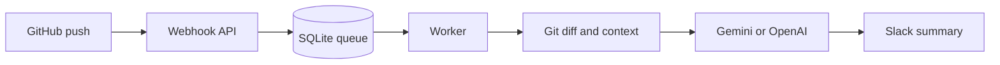

# GitHub Change Bot

GitHub Change Bot watches GitHub pushes and sends a short explanation of each
code change to Slack. It uses the Git diff as the source of truth and sends
only the changed code plus small surrounding context to Gemini or OpenAI.

## What happens after a push



The webhook replies quickly. Git, AI, and Slack work happens in the background
worker, so GitHub does not wait for a slow AI request.

## What you need

- A Linux VM with Python 3.12, Git, rsync, and curl.
- A GitHub repository for this bot.
- An SSH key that can read each GitHub repository you want to analyse.
- A Google Gemini API key or OpenAI API key.
- A Slack incoming webhook URL.
- A public HTTPS URL for GitHub webhooks. For free testing, use the included
  Cloudflare Quick Tunnel setup.

## Fast setup on a Linux VM

Clone the project:

```bash
git clone git@github.com:jvishwa-sqy/github-change-bot.git
cd github-change-bot
```

Create a private environment file. Do not commit this file.

```bash
cp .env.example /secure/git-change-bot.env
chmod 600 /secure/git-change-bot.env
```

Edit `/secure/git-change-bot.env` and fill these required values:

```env
GITHUB_WEBHOOK_SECRET=generate-a-long-random-secret
SLACK_WEBHOOK_URL=https://hooks.slack.com/services/...
LLM_PROVIDER=google
GOOGLE_API_KEY=your-google-api-key
```

Generate a webhook secret if needed:

```bash
openssl rand -hex 32
```

Install the bot. Replace the SSH key path with the existing key that has
GitHub read access.

```bash
sudo ./scripts/install_systemd.sh \
  --env-file /secure/git-change-bot.env \
  --ssh-key /secure/id_ed25519
```

The installer creates and starts two services:

```text
git-change-bot-web       receives GitHub webhooks
git-change-bot-worker    analyses queued pushes
```

Check that both work:

```bash
curl -sS http://127.0.0.1:8088/health
sudo systemctl status git-change-bot-web git-change-bot-worker --no-pager
```

## Free public URL for testing

GitHub must reach the webhook over public HTTPS. If you do not have a domain,
use a Cloudflare Quick Tunnel. It is free, but its URL changes after a restart.

Install Cloudflare Tunnel on the VM, then run:

```bash
cloudflared tunnel --url http://127.0.0.1:8088
```

It prints a URL similar to:

```text
https://example-name.trycloudflare.com
```

Keep this process running. Your GitHub webhook URL is:

```text
https://example-name.trycloudflare.com/webhooks/github
```

Use a real domain and reverse proxy when the bot moves beyond testing.

## Add the GitHub webhook

Open the repository you want to monitor in GitHub:

```text
Repository → Settings → Webhooks → Add webhook
```

Set these values:

| Field | Value |
|---|---|
| Payload URL | `https://YOUR-PUBLIC-URL/webhooks/github` |
| Content type | `application/json` |
| Secret | Same value as `GITHUB_WEBHOOK_SECRET` |
| SSL verification | Enable |
| Events | Just the push event |
| Active | Enabled |

GitHub sends a ping immediately. A successful delivery returns:

```json
{"status":"pong"}
```

## Prepare a repository for analysis

Run this once for every repository you want the bot to analyse. Replace the
repository ID and URL.

```bash
sudo -u gitbot env BOT_ENV_FILE=/etc/git-change-bot.env \
  /opt/git-change-bot/.venv/bin/python /opt/git-change-bot/scripts/bootstrap_repo.py \
  --project-id GITHUB_REPOSITORY_ID \
  --repo-url git@github.com:OWNER/REPOSITORY.git \
  --project-name OWNER/REPOSITORY \
  --ref main
```

Find the numeric repository ID at:

```text
https://api.github.com/repos/OWNER/REPOSITORY
```

The bootstrap command creates a bare Git mirror and a lightweight repository
map. It does not call the AI model or send Slack messages.

## Test the full flow

Make a small real change in the monitored repository and push it:

```bash
git add .
git commit -m "Test change bot"
git push origin main
```

Watch the worker:

```bash
sudo journalctl -u git-change-bot-worker -f
```

Expected flow:

```text
push enqueued → job started → diff computed → AI response → Slack notified → job completed
```

## Docker option

Docker Compose is useful when you do not want to install systemd services.

```bash
cp .env.example .env
# Fill .env with the same required values.

export BOT_SSH_DIR=/secure/directory-containing-id_ed25519
docker compose up --build -d
curl -sS http://127.0.0.1:8088/health
```

For a free temporary tunnel with Docker:

```bash
docker compose -f compose.yaml -f compose.tunnel.yaml up --build -d
docker compose -f compose.yaml -f compose.tunnel.yaml logs tunnel
```

## Move to another VM

The source code does not store secrets, Git mirrors, SQLite data, or private
keys. To move the bot:

1. Clone the repository on the new VM.
2. Copy the private environment file through a secure channel.
3. Provide an SSH key with GitHub read access.
4. Run `scripts/install_systemd.sh` on the new VM.
5. Bootstrap the repositories there.
6. Change each GitHub webhook to the new public URL.
7. Stop the web, worker, and tunnel services on the old VM after confirming
   the new VM works.

More implementation details are in [DEPLOYMENT.md](DEPLOYMENT.md).

## Common checks

```bash
# Health and queue count
curl -sS http://127.0.0.1:8088/ready

# Service state
sudo systemctl is-active git-change-bot-web git-change-bot-worker

# Recent errors
sudo journalctl -u git-change-bot-worker -n 100 --no-pager
```
