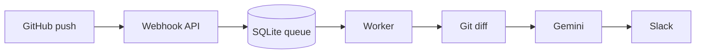

# GitHub Change Bot

GitHub Change Bot turns GitHub pushes into concise Slack summaries. It reads
the real Git diff, adds limited nearby code context, asks Gemini for
an explanation, and posts a polished Slack card with the risk level, change
size, key changes, affected areas, and GitHub diff link.



Docker Compose is the supported way to run this project. It starts the
webhook API, background worker, persistent data volume, and a free temporary
Cloudflare HTTPS tunnel together.

## What you need

- Docker Engine and the Docker Compose plugin. Follow the official
  [Docker installation guide](https://docs.docker.com/engine/install/) for
  your VM operating system.
- A GitHub repository to monitor.
- An SSH key that can read that repository.
- A Gemini API key.
- A Slack incoming webhook URL.

Check Docker before continuing:

```bash
docker --version
docker compose version
```

## 1. Clone the project

```bash
git clone git@github.com:jvishwa-sqy/github-change-bot.git
cd github-change-bot
```

Keep the private files you manage in the project root:

```text
github-change-bot/
├── .env                 private configuration; never commit it
├── config.py            runtime configuration
├── id_ed25519           GitHub-readable SSH private key; never commit it
├── id_ed25519.pub       public half of that key
├── README.md            this guide
├── compose.yaml         Docker services
└── app/                 application code
```

`.env`, `id_ed25519`, and `id_ed25519.pub` are ignored by Git.

## 2. Add the GitHub SSH key

Copy the existing key that can clone the repositories you want to monitor:

```bash
cp /path/to/id_ed25519 ./id_ed25519
cp /path/to/id_ed25519.pub ./id_ed25519.pub
chmod 600 ./id_ed25519
chmod 644 ./id_ed25519.pub
```

Verify GitHub access:

```bash
ssh -i ./id_ed25519 -o IdentitiesOnly=yes -T git@github.com
```

If GitHub rejects the key, add `id_ed25519.pub` in GitHub:

- One repository: **Repository → Settings → Deploy keys → Add deploy key**.
  Keep write access disabled.
- Many repositories: add the key to a GitHub user with read access to all of
  those repositories.

## 3. Create `.env`

```bash
cp .env.example .env
chmod 600 .env
```

`.env` contains the two API secrets and the Slack webhook URL:

```env
GITHUB_WEBHOOK_SECRET=replace-with-a-random-secret
GOOGLE_API_KEY=replace-with-your-google-api-key
SLACK_WEBHOOK_URL=https://hooks.slack.com/services/...
```

`config.py` contains every non-secret runtime setting.

Generate the GitHub secret with:

```bash
openssl rand -hex 32
```

Do not share `.env`, API keys, Slack webhook URLs, or the private SSH key.

## 4. Create the Slack webhook

Suggested Slack app description:

```text
Turns GitHub code pushes into clear, AI-powered Slack change summaries.
```

1. Open <https://api.slack.com/apps> and select **Create New App**.
2. Select **From scratch**, name it `GitHub Change Bot`, and choose your
   Slack workspace.
3. Open **Incoming Webhooks** in the left menu.
4. Enable **Activate Incoming Webhooks**.
5. Click **Add New Webhook to Workspace**.
6. Select the Slack channel for change summaries and click **Allow**.
7. Copy the URL beginning with `https://hooks.slack.com/services/`.
8. Paste it into `.env` as `SLACK_WEBHOOK_URL`.

If the URL is ever exposed, delete that webhook in Slack and create a new one.

## 5. Get an AI key

### Gemini

1. Open <https://aistudio.google.com/apikey>.
2. Create an API key.
3. Put it in `.env` as `GOOGLE_API_KEY`.

## 6. Start the bot

From the project root, start everything with the single startup command:

```bash
./start.sh
```

It checks the required configuration, protects the SSH key permissions, builds
the image, starts the services, waits for the webhook API, and prints the
Cloudflare URL when it is available. Run it again after changing `.env`,
`config.py`, or pulling a new version of the project.

Compose starts these services:

| Service | Purpose |
|---|---|
| `web` | Receives and verifies GitHub webhooks |
| `worker` | Fetches Git changes, calls AI, and sends Slack messages |
| `tunnel` | Creates a free public HTTPS URL for testing |

Check that the API is healthy:

```bash
curl -sS http://127.0.0.1:8088/health
docker compose ps
```

Expected response:

```json
{"status":"ok"}
```

## 7. Get the public webhook URL

The `tunnel` service writes a temporary `trycloudflare.com` URL to its logs:

```bash
docker compose logs tunnel
```

Copy the URL and add `/webhooks/github` to it:

```text
https://example-name.trycloudflare.com/webhooks/github
```

The URL changes if the tunnel container restarts. This free tunnel is for
testing; update the GitHub webhook whenever its URL changes.

## 8. Add the GitHub webhook

For each repository the bot should monitor, open:

```text
Repository → Settings → Webhooks → Add webhook
```

Set:

| GitHub field | Value |
|---|---|
| Payload URL | The public URL ending in `/webhooks/github` |
| Content type | `application/json` |
| Secret | `GITHUB_WEBHOOK_SECRET` from `.env` |
| SSL verification | Enable SSL verification |
| Events | Just the push event |
| Active | Checked |

GitHub sends a ping after saving. A successful ping returns:

```json
{"status":"pong"}
```

## 9. Bootstrap each monitored repository

Bootstrap creates a local bare mirror and repository map before the first
push. It does not call AI or post to Slack.

Run once per repository:

```bash
docker compose exec --user 10001:10001 worker \
  python scripts/bootstrap_repo.py \
  --project-id GITHUB_REPOSITORY_ID \
  --repo-url git@github.com:OWNER/REPOSITORY.git \
  --project-name OWNER/REPOSITORY \
  --ref main
```

Find `GITHUB_REPOSITORY_ID` at:

```text
https://api.github.com/repos/OWNER/REPOSITORY
```

Repeat the webhook and bootstrap steps for every repository you monitor.

## 10. Test the full flow

Make a small real change in a monitored repository and push it:

```bash
git add .
git commit -m "Test GitHub Change Bot"
git push origin main
```

Watch processing logs:

```bash
docker compose logs --follow worker
```

Expected flow:

```text
push enqueued → job started → diff computed → AI response → Slack notified → job completed
```

## Daily commands

```bash
# Current service state
docker compose ps

# API health and queue counts
curl -sS http://127.0.0.1:8088/ready

# Recent worker logs
docker compose logs --tail 100 worker

# Restart after editing .env or config.py
docker compose up -d --force-recreate

# Stop the bot
docker compose down
```

The queue, Git mirrors, and repository maps are stored in the persistent
`bot-data` Docker volume. `docker compose down` stops containers but preserves
that volume. Use `docker compose down -v` only when you intentionally want to
delete all queue and mirror data.

## Move to another VM

1. Clone this repository on the new VM.
2. Securely copy `.env`, `config.py`, `id_ed25519`, and `id_ed25519.pub` into
   the new project root.
3. Run `./start.sh`.
4. Bootstrap every monitored repository.
5. Update GitHub webhooks with the new tunnel URL.
6. After testing the new VM, run `docker compose down` on the old VM.
